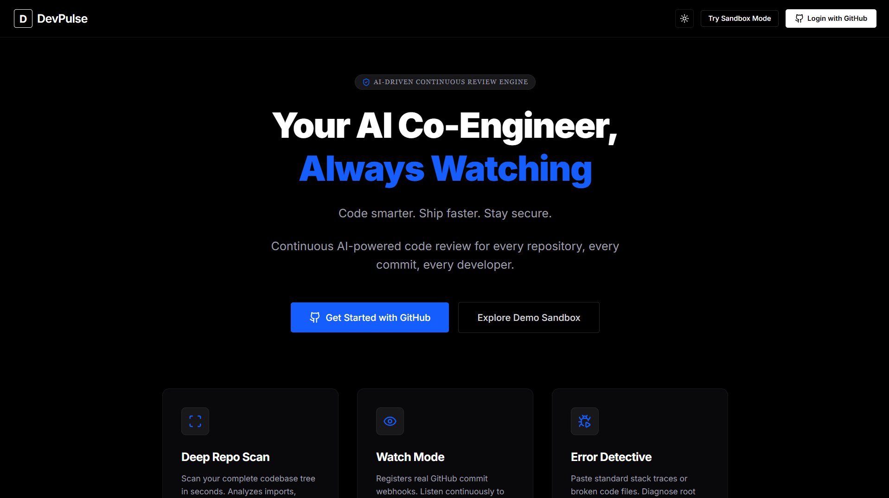
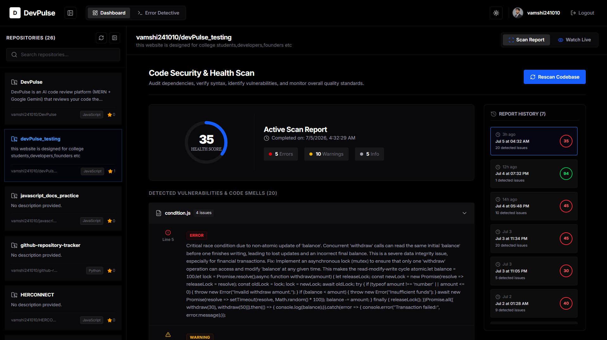
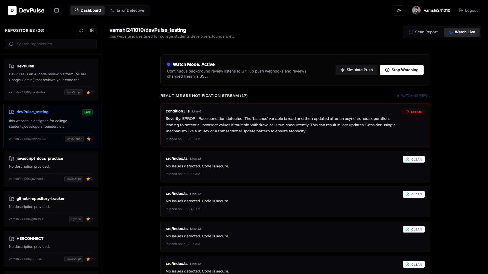
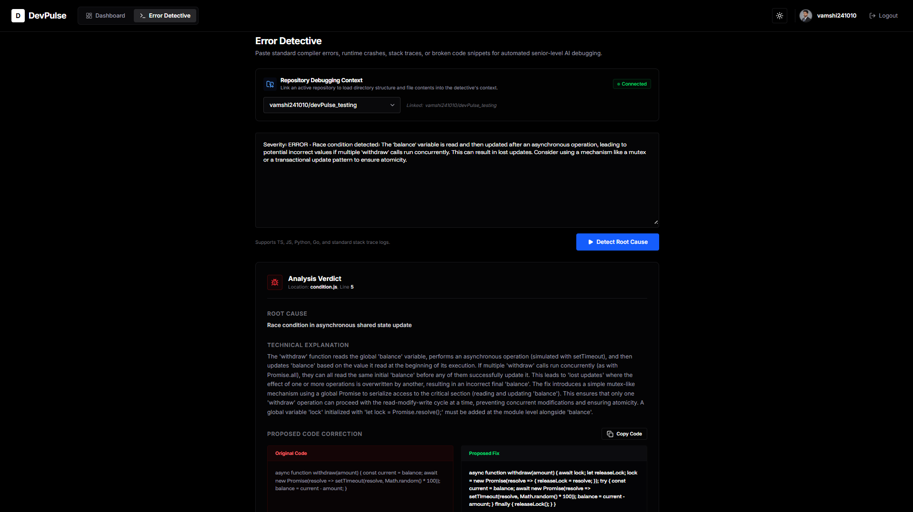

# 🚀 DevPulse

> **Your AI Co-Engineer for Continuous Code Quality**

DevPulse is an AI-powered code intelligence platform that automatically reviews your GitHub repositories, detects bugs and security vulnerabilities, monitors every commit in real time, and provides intelligent debugging assistance — all from a single dashboard.

---

## 🌍 Problem Statement

Every day, developers push code that breaks in production — not because they are careless, but because code moves faster than humans can review it.

The average developer pushes 10 to 15 commits every single day. Senior engineers simply do not have enough time to review every single change. Because of this, bugs, security vulnerabilities, and performance issues slip through undetected — reaching production where fixing them becomes expensive, risky, and damaging to user trust.

Small teams, students, and solo developers rarely have access to experienced code reviewers at all. They ship software and hope for the best.

Software bugs cost the world **$80 billion every year.**

DevPulse closes that gap — permanently.

---

## 🎯 Vision

> **Every developer deserves an expert reviewing their code — 24 hours a day, 7 days a week, for free.**

DevPulse makes enterprise-grade code quality accessible to every developer in the world through continuous AI-powered code reviews directly inside the GitHub workflow.

---

## ✨ Features

### 🔍 Repository Scan
- Scan your entire codebase with one click
- Detects bugs, security vulnerabilities, performance issues, and bad coding practices
- Generates a Repository Health Score from 0 to 100
- Severity-based issue classification — Error, Warning, Info
- Exact file name and line number for every issue
- Clear AI-powered explanation for every detected problem
- Scan history with timestamps for tracking improvement over time

---

### ⚡ Watch Mode
- Real-time GitHub Webhook integration
- Automatically reviews every commit the moment it is pushed
- Detects issues in changed lines only — fast and lightweight
- Live notifications via Server-Sent Events — no page refresh needed
- Toast notifications across the entire app when a push is detected
- Tracks full watch event history per repository
- Zero manual intervention — push code and DevPulse does the rest

---

### 🕵️ Error Detective
- Paste any error message or broken code snippet
- AI traces the exact root cause instantly
- Identifies the precise file and line number responsible
- Before vs After code comparison — broken code in red, fixed code in green
- AI-generated corrected code ready to copy
- One-click Copy Fix button
- One-click Open in VS Code — jumps directly to the exact file and line in your editor

---

## 🔑 Key Technical Decisions

**SSE over WebSockets**
Watch mode only needs server-to-client communication. Server-Sent Events are lighter, simpler, and natively supported in all modern browsers without extra libraries. The browser automatically reconnects if the connection drops.

**Git diff parsing**
We parse the unified git diff ourselves before sending to Gemini — pre-calculating the exact file line number for every changed line. This means Gemini receives accurate line numbers directly instead of guessing from diff hunk headers, making Watch mode notifications precise.

**Structured JSON schema**
All three Gemini integrations use native responseSchema with strict typed fields. This means AI responses are always predictable, parseable, and renderable in the UI without any post-processing guesswork or markdown stripping.

**Graceful fallback system**
If the Gemini API fails, rate limits, or returns malformed output — DevPulse falls back to structured mock data instead of crashing or showing a blank screen. The demo never breaks. The user always gets a response.

**Validation layer**
A custom validation function checks every Gemini response before it reaches the UI. If Gemini claims there is an error but returns no fix, the response is rejected and the fallback activates. This prevents false positives and empty fix panels from ever appearing on screen.

**Auto webhook cleanup**
Before registering a new Watch webhook, DevPulse automatically deletes any stale existing webhooks pointing to old URLs. This means Watch mode works cleanly every time — even after restarting ngrok or redeploying — without manual cleanup.

---

## 🛠 Tech Stack

### Frontend
- React
- Vite
- Tailwind CSS
- Framer Motion
- Lucide Icons

### Backend
- Node.js
- Express.js

### Database
- MongoDB
- Mongoose

### Authentication
- Passport.js
- GitHub OAuth

### AI
- Google Gemini 1.5 Flash

### Real-time
- Server-Sent Events (SSE)

### APIs
- GitHub REST API v3
- GitHub Webhooks

### Development
- ngrok (local webhook tunneling)

---

## 🏗 Architecture
GitHub Repository
│
▼
GitHub OAuth Authentication
│
▼
DevPulse
│
┌──────┼──────────┐
│      │          │
▼      ▼          ▼
Scan  Watch    Error Detective
│      │          │
│      │          │
│   GitHub        │
│   Webhook       │
│      │          │
▼      ▼          ▼
Gemini 1.5 Flash
AI Code Analysis
│
▼
MongoDB Storage
│
▼
SSE Live Stream
│
▼
React Dashboard

---

## 🔄 How It Works

### Scan Flow
1. User selects a repository
2. DevPulse fetches all code files via GitHub REST API
3. Files are sent to Gemini 1.5 Flash for deep analysis
4. Gemini returns structured JSON — health score plus issues list
5. Results are stored in MongoDB and rendered on dashboard

### Watch Flow
1. User enables Watch Mode
2. DevPulse auto-deletes any stale webhook and registers a fresh one via GitHub API
3. Developer pushes code to GitHub
4. GitHub fires a webhook to DevPulse server instantly
5. Server extracts the git diff and parses exact line numbers
6. Changed lines sent to Gemini for review
7. Result stored in MongoDB
8. SSE pushes notification live to dashboard — no refresh needed

### Error Detective Flow
1. User pastes any error message or broken code
2. Gemini traces root cause, identifies file and line, generates fix
3. Response validated before rendering
4. User sees broken code vs fixed code side by side
5. One click copies the fix
6. One click opens VS Code at the exact line

---

## 🚀 Getting Started

### Prerequisites
- Node.js 18 or higher
- MongoDB Atlas account or local MongoDB
- GitHub account
- Google AI Studio account for Gemini API key
- ngrok account (free) for Watch mode in development

---

### Clone the Repository

```bash
git clone https://github.com/vamshi241010/devpulse.git
cd devpulse
```

---

### Install Dependencies

```bash
# Install all dependencies from root
npm install
```

---

### Environment Variables

Create a `.env` file in the root folder:

```env
# Server
PORT=3000
NODE_ENV=development

# MongoDB
MONGO_URI=your_mongodb_connection_string

# GitHub OAuth
GITHUB_CLIENT_ID=your_github_client_id
GITHUB_CLIENT_SECRET=your_github_client_secret
CALLBACK_URL=http://localhost:3000/auth/github/callback

# Session
SESSION_SECRET=your_random_secret_string

# AI
GEMINI_API_KEY=your_gemini_api_key

# Webhook
WEBHOOK_URL=your_ngrok_url/api/webhook
```

---

### Run the Application

```bash
# Terminal 1 — Start the full application
npm run dev
```

```bash
# Terminal 2 — Start ngrok for Watch Mode (development only)
ngrok http 3000

# Copy the ngrok URL (e.g. https://xxxx.ngrok-free.app)
# Add /api/webhook to the end
# Paste it as WEBHOOK_URL in your .env file
```

---

### Register GitHub OAuth App

1. Go to GitHub → Settings → Developer Settings → OAuth Apps → New OAuth App
2. Fill in:
   - **Application name:** DevPulse
   - **Homepage URL:** http://localhost:5173
   - **Authorization callback URL:** http://localhost:3000/auth/github/callback
3. Copy Client ID and Client Secret into your `.env` file

---

## 📊 Workflow

1. Login with GitHub
2. Select Repository
3. Run Repository Scan — get health score and issues
4. Enable Watch Mode — DevPulse starts monitoring
5. Push Code — DevPulse reviews it automatically
6. Receive Live AI Review — notification appears instantly
7. Use Error Detective — paste any error, get exact fix
8. Open in VS Code — jump to exact file and line
9. Fix Issues
10. Ship Better Software 🚀

---

## 📸 Screenshots

### Dashboard


### Repository Scan


### Watch Mode — Live Notification


### Error Detective


---

## 💡 Future Scope

- **Pull Request Review Bot** — DevPulse comments directly on GitHub PRs like a real engineer
- **VS Code Extension** — receive notifications and apply fixes without leaving the editor
- **GitHub Actions Integration** — block merges when critical issues are detected
- **GitLab and Bitbucket Support** — extend beyond GitHub
- **Slack and Discord Notifications** — team alerts when bugs are detected
- **Multi-AI Review Engine** — run reviews through multiple models and compare results
- **Team Analytics Dashboard** — track which developers push the most bugs, which files break most often
- **Dependency Vulnerability Scanner** — detect outdated and vulnerable npm packages
- **AI Auto-Fix Pull Requests** — DevPulse opens a PR with the fix already applied
- **Enterprise Policy Checks** — custom rules for large organizations

---

## 🤝 Contributing

Contributions are welcome from developers of all experience levels.

1. Fork the repository
2. Create a new branch

```bash
git checkout -b feature/your-feature-name
```

3. Make your changes and commit

```bash
git commit -m "Add: your feature description"
```

4. Push to your branch

```bash
git push origin feature/your-feature-name
```

5. Open a Pull Request — DevPulse will review it automatically 😄

---

## 📜 License

MIT License — free to use, modify, and distribute.

---

## ⭐ Support

If DevPulse helps you ship better code, consider giving it a ⭐ on GitHub.

It helps the project reach more developers who need it.

---

## ❤️ Built With Passion

*Made by developers, for developers — because great software starts with great code.*

*We built DevPulse because we've been that developer at 2am, staring at a bug that should have been caught hours earlier.*

*DevPulse is the tool we wish we had.*
